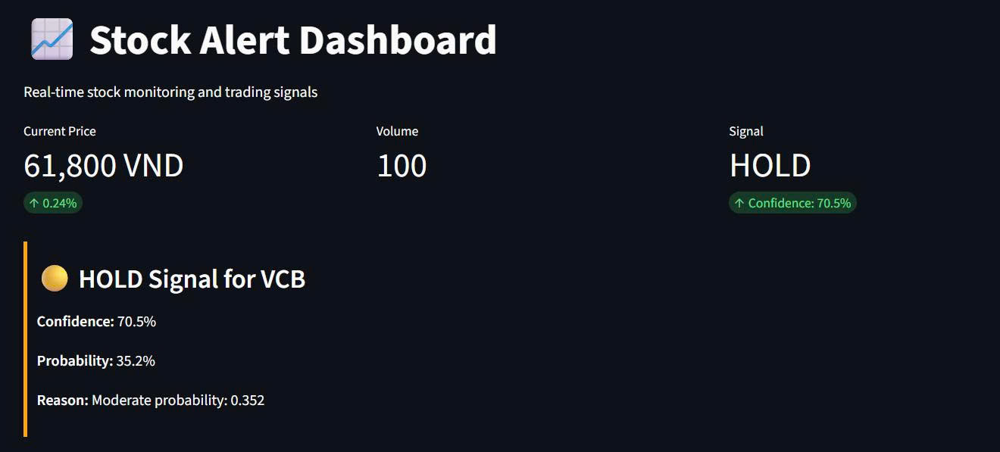
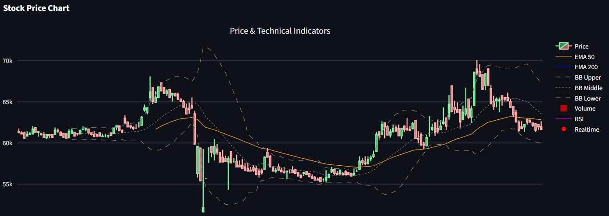
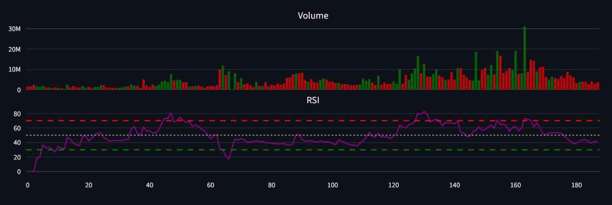
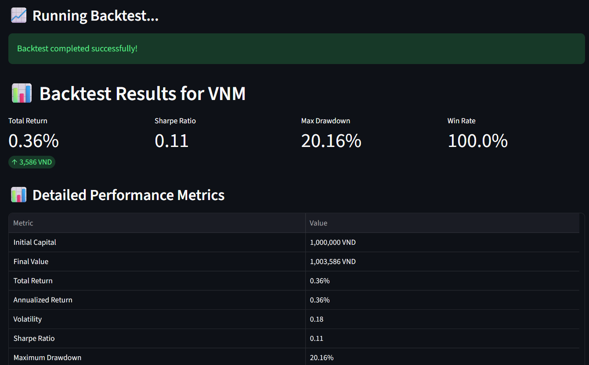
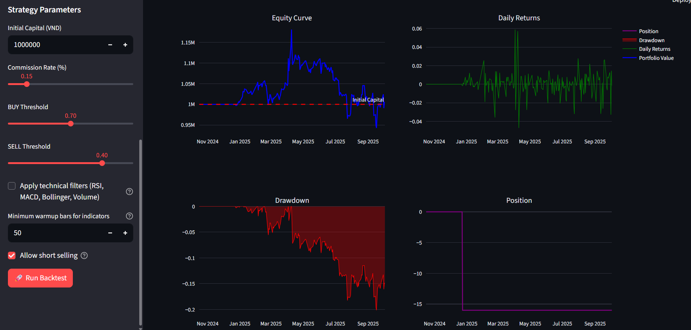

## Stock Alert Dashboard

Realtime monitoring, ML‑based signals, and backtesting built with Streamlit.

### Demo








### 1) Features
- Realtime dashboard with OHLCV, RSI, EMA(50/200), Bollinger Bands
- ML probability → BUY/SELL/HOLD, optional technical filters
- Backtesting with configurable thresholds, fees, warmup, and short selling
- Diagnostics: signal distribution, probability series, latest feature row

### 2) Structure
```
stock_alert_dashboard/
  app.py           # Streamlit entry
  pages/
    dashboard.py   # Realtime page
    backtest_page.py
    settings.py
  utils/
    fetch_data.py  # Data loaders
    features.py    # TechnicalIndicators
    preprocess.py  # Feature prep for model
    signals.py     # SignalGenerator
    backtest.py    # Backtester
  models/
    checkpoint.pkl
    feature_columns.json
    scaler.pkl
  data/
    historical/
    realtime/
    signals_log.csv
    screenshots/
  config.py
  requirements.txt
```

### 3) Setup
```bash
python -m venv venv
venv\Scripts\activate   # Windows
pip install -r requirements.txt
python realtime_stream.py
streamlit run app.py
```

### 4) Configuration
Edit `config.py`: tickers, paths, thresholds (`BUY_THRESHOLD`, `SELL_THRESHOLD`), indicator periods, commission, initial capital.

### 5) Data
- Historical CSVs in `data/historical/` with columns: `Ticker, TradingDate, Open, High, Low, Close, MatchVolume`.
- Financial ratios via `DataFetcher.fetch_financial_ratios`.
- Realtime JSON optional in `data/realtime/`.

### 6) Dashboard
- Select ticker, see price/indicators, and current signal with probability.
- Signals are logged to `data/signals_log.csv`.
 - Demo:
   - Dashboard: `data/screenshots/dashboard.png`
   - Backtest: `data/screenshots/backtest.png`

### 7) Backtesting
- Sidebar: Capital, Commission, BUY/SELL thresholds, Technical filters, Warmup bars, Allow short selling.
- Outputs: Equity curve, daily returns, drawdown, position, trades, metrics, and CSV exports.
- Tuning tips: reduce BUY threshold to ~0.55–0.60, increase SELL to ~0.40–0.45, warmup 20–30.

### 8) Model
- Inference expects features in `models/feature_columns.json` order. Missing features are added as 0.0 and scaled with `models/scaler.pkl` if present.
- Build demo model: `python models/create_sample_model.py`.

### 9) Short Selling
- Enable in Backtest sidebar: SELL when flat opens short; BUY when short covers.

### 10) Troubleshooting
- Feature row all zeros → check OHLCV headers and that indicators were computed; ensure `Ticker`/`TradingDate` exist.
- No trades → thresholds too strict or short disabled.
- Feature mismatch → update `feature_columns.json` to match training.

### 11) License & Support
- MIT (or your internal terms)
- Issues/Questions: open an issue and include logs/screenshots.
